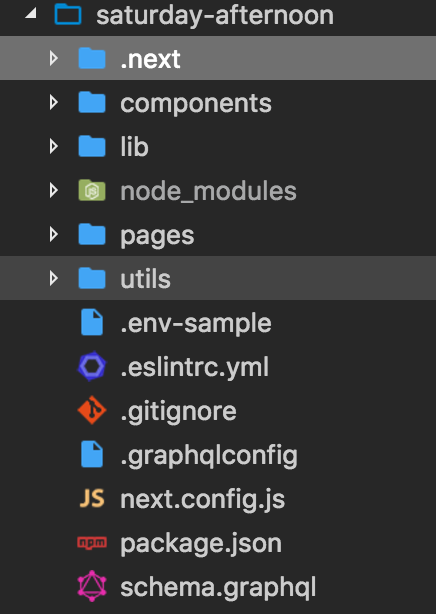

# How to use environmental (env) variables

* [What are env vars](#what-are-env-vars)
* [How to use them](#how-to-use)

## What are env vars

Environmental variables are variables that are set at runtime (when you start your application). It's a good way of not having to hardcode sensitive information or variables that you change often into your app.

Example:

Instead of having
`const url = process.env.NODE_ENV === 'dev' ? 'https://production.com/' : 'https://test.com/`

You can have
`const url = process.env.URL`

Or for further safety
`const url = process.env.URL || 'https://test.com/'`

## How to use

In the `saturday-afternoon` folder you can find the file `.env-sample`:


However to use it you need a `.env`

To create a `.env` file simply duplicate `.env-sample` and rename it to `.env`.

In the file you will find the following value:

```
GRAPHQL_ENDPOINT_URL=
```

All this is is a key - value combination. So for this project we would use the following:

```
GRAPHQL_ENDPOINT_URL=https://graphql.kiwi.com
```

Put this into the `.env` file, hit save and you can access it in the application under `process.env.GRAPHQL_ENDPOINT_URL`.
